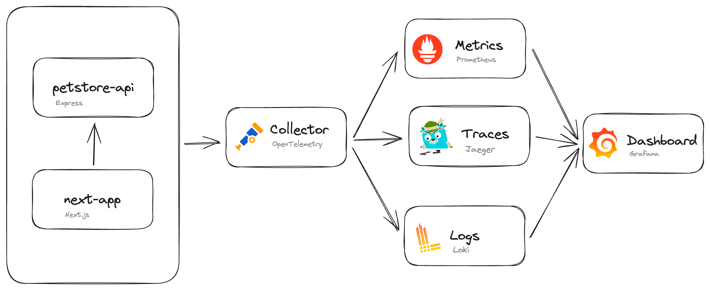

# OpenTelemetry - Grafana Demo

This demo application demonstrates how to instrument JavaScript applications using open source observability tools. The following projects are used:

- [OpenTelemetry](https://opentelemetry.io/) - Instrument the application and send observability data to each backend.
- [Jaeger](https://www.jaegertracing.io/) - Distributed tracing backend.
- [Prometheus](https://prometheus.io/) - Metrics and alerting backend.
- [Loki](https://grafana.com/oss/loki/) - Logs aggregation system.
- [Grafana](https://grafana.com/) - Visualize all of our observability data.

## Project Structure

## Running the app

1. Run with `npm run dev`. Requires [Docker](https://www.docker.com/) and docker-compose.
1. Open the app at http://localhost:3030
1. View traces, logs, and metrics in Grafana at http://localhost:3000

## Additional Resources and Inspirations

- [Next.js OpenTelemetry](https://nextjs.org/docs/app/building-your-application/optimizing/open-telemetry)
- [OpenTelemetry Collector Demo](https://github.com/open-telemetry/opentelemetry-collector-contrib/tree/main/examples/demo)
- [OpenTelemetry to your browser app](https://opentelemetry.io/docs/instrumentation/js/getting-started/browser/)

- [OpenTelemetry - Grafana Demo](https://github.com/connorlindsey/otel-grafana-demo)
- [OpenTelemetry JS](https://github.com/open-telemetry/opentelemetry-js)
- [OpenTelemetry Status](https://opentelemetry.io/status/)
